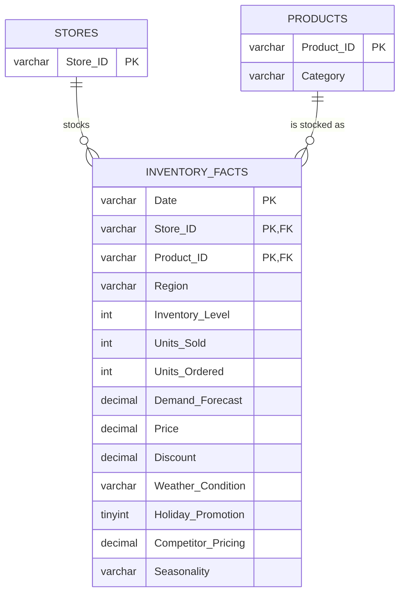

# Entity-Relationship Diagram

Normalized schema for `retail_db` (see [schema.sql](schema.sql) for the DDL, and [build_database.py](../db/build_database.py) for the runnable SQLite build).

## Why Region isn't its own dimension

Profiling `inventory_forecasting.csv` showed every `Store_ID` paired with all 4 regions, and all 150 `(Store_ID, Product_ID)` pairs span multiple regions across dates. Region is not a fixed attribute of a store or a product in this dataset — it has to live on the fact row. `Category`, by contrast, is a true 1:1 attribute of `Product_ID` (30 distinct pairs for 30 products), so it normalizes onto `products`.

A `retail_data` view joins the three tables back into the original flat shape, so every query written against the single flat table (see [SQL-scripts.pdf](../SQL-scripts.pdf)) still runs unmodified.
